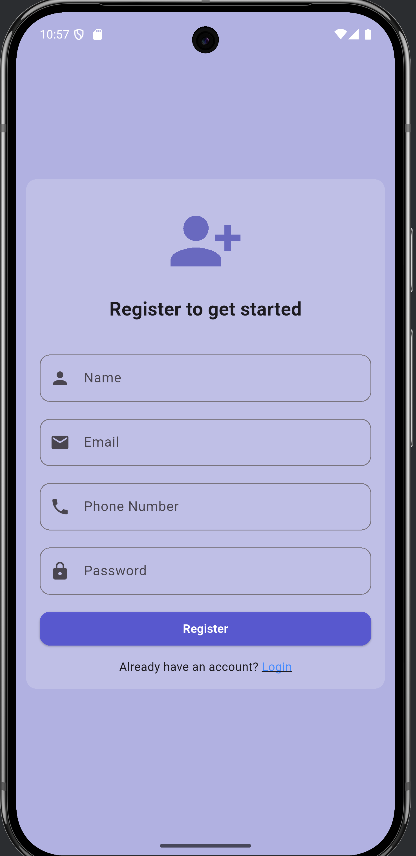
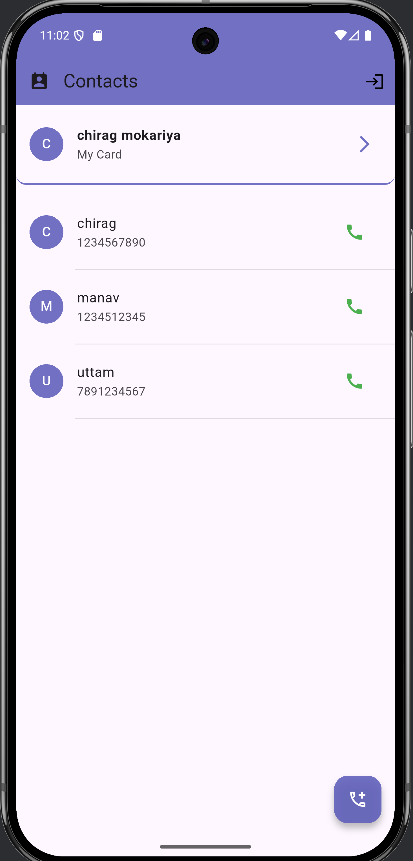
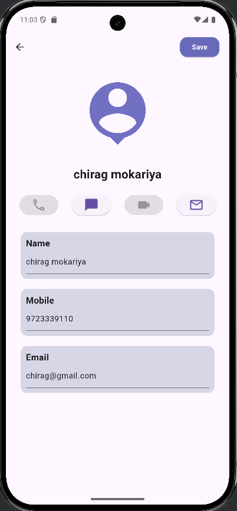
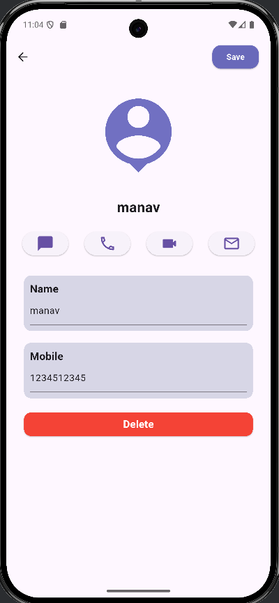

# Flutter Contact App

A Flutter application for **Contact Management** with **Login/Register** functionality using **SharedPreferences** and **SQLite (Sqflite)** for storing contacts.

---

## Features

- **User Authentication**
    - Register a new user
    - Login existing user
    - Save login session with **SharedPreferences**
- **Contact Management**
    - Add new contacts
    - Update existing contacts
    - Delete contacts
    - View contact list
- **Local Database**
    - Uses **Sqflite** for persistent local storage
- **Flutter Setup**
    - Fully compatible with Flutter latest stable version

---

## Screenshots
- **Register Screen**

- **Login Screen**

- **Home Screen**

- **MyCard Screen**

- **Contact Edit or Delete Screen**
